# 🤖 AI Engineer Assessment

This repository contains the complete end-to-end implementation for the **AI Engineer Assessment**, covering:

- 🎙️ Knowledge-Grounded Voice Agents
- 🌍 Multilingual Voice Routing
- ⚡ Real-Time Streaming Nudges

---

## 🎥 Demo

> **Video Walkthrough:** *[(https://drive.google.com/file/d/1LL_A7jCL-_Qu6Q_MScJ337KOzbpeJdWH/view?usp=sharing)]*

---

# 🏗️ Architecture Overview




The solution is designed as a modular, production-inspired architecture consisting of three independent pipelines.

---

## 📂 Project Structure

```
.
├── kb/
│   ├── data/
│   ├── vectordb/
│   └── test_retrieval.py
|   |__ recordings
│
├── multilingual/
│   ├── ph_config.json
│   ├── id_config.json
│   ├── recordings/
│   └── transcripts/
│
├── nudges/
│   ├── main.py
│   ├── streaming.py
│   └── controller.py
│
├── architecture.svg
├── requirements.txt
└── README.md
```

---

## 📦 Components

### 📚 Knowledge Base (Questions 1 & 2)

Implements a **Retrieval-Augmented Generation (RAG)** pipeline using **ChromaDB**.

### Features

- Document cleaning
- Text chunking
- Vector embeddings
- Semantic retrieval
- Grounded FAQ answering
- Hallucination prevention

---

### 🌍 Multilingual Voice Routing (Question 3)

A configuration-driven routing framework using:

- `ph_config.json`
- `id_config.json`

Each configuration controls:

- Deepgram Nova-2 language hints
- Azure Neural TTS voices
- Localization rules
- Escalation messages
- Business prompts

This architecture allows adding new countries without changing application logic.

---

### ⚡ Streaming Nudges (Question 4)

An asynchronous streaming pipeline that processes live conversations.

Pipeline:

```
Audio
    │
    ▼
Deepgram Nova-2 (Streaming ASR)
    │
    ▼
Rolling Transcript Buffer
    │
    ▼
Groq (Llama-3)
    │
    ▼
JSON Signal Extraction
    │
    ▼
Nudge Controller
    │
    ▼
Terminal Dashboard
```

Features

- Streaming transcription
- Speaker separation
- Sub-second signal extraction
- Duplicate suppression
- Confidence filtering

---

# 🚀 Setup

## 1. Clone Repository

```bash
git clone <repository-url>

cd AI-Engineer-Assessment
```

---

## 2. Create Virtual Environment

### Linux / macOS

```bash
python -m venv venv
source venv/bin/activate
```

### Windows

```powershell
python -m venv venv

venv\Scripts\activate
```

---

## 3. Install Dependencies

```bash
pip install -r requirements.txt
```

---

# 🔑 Environment Variables

Create a `.env` file inside the required folders.

Required API Keys:

- Deepgram API Key
- Groq API Key
- Azure Speech API (TTS)

No secrets are committed to this repository.

---

# ▶️ Running the Project

## Question 2 — Retrieval

```bash
python kb/test_retrieval.py
```

---

## Question 4 — Live Streaming Nudges

```bash
python nudges/main.py
```

This simulates a live audio stream and outputs real-time terminal nudges.

---

## Question 1 & 3 — Voice Agent

Voice call recordings are available in

```
multilingual/recordings/
```

Transcripts are available in

```
multilingual/transcripts/
```

---

# 📊 Question 3 Evaluation

## Deepgram Nova-2 Performance

Deepgram Nova-2 was selected because of its superior multilingual capabilities and streaming latency.

---

## 🇵🇭 Philippines (Taglish)

### Configuration

- Filipino language model

### Performance

Successfully handled rapid Taglish code-switching.

Example

```
policy
premium
renewal
```

embedded naturally inside Tagalog sentences.

### Observed Errors

| Expected | Transcribed |
|-----------|-------------|
| ise-escalate | iseigisa |
| mag-lapse | maglapsi |

These occur because English loanwords are pronounced using Tagalog phonetics.

---

## 🇮🇩 Indonesia (Bahasa Indonesia)

### Configuration

- Indonesian language model

### Performance

Handled transitions between:

- Formal register
- Informal conversational speech

Examples

Formal

```
Bapak
Ibu
```

Informal

```
nggak
suka telat
```

---

# 🌐 Localization vs Translation

The assistant prioritizes **natural localization** over literal translation.

---

## 🇵🇭 Philippines (Life Insurance)

| Direct Translation | Localized Version | Strategy |
|-------------------|------------------|----------|
| Your policy will cancel if you don't pay. | Kailangan po nating ma-settle ang premium para hindi mag-lapse ang inyong policy. | Retains English insurance terminology while using respectful Tagalog. |
| I will transfer you to a manager. | Ise-escalate ko na po ito sa aming specialist. | Uses common Taglish verb construction. |

---

## 🇮🇩 Indonesia (Multifinance)

| Direct Translation | Localized Version | Strategy |
|-------------------|------------------|----------|
| Your payment is due tomorrow. | Besok itu jatuh tempo cicilan motor Bapak. | Uses authentic local finance terminology. |
| I don't know the answer. | Mohon maaf Bapak/Ibu, saya akan eskalasikan hal ini. | Switches to a formal customer-service register. |

---

# 🔊 Native TTS

Azure Neural TTS was selected because of its natural regional voices.

| Market | Voice |
|---------|------|
| Philippines | fil-PH-BlessicaNeural |
| Indonesia | id-ID-GadisNeural |

### Limitation

While pronunciation is excellent, emotional delivery during customer escalations occasionally sounds robotic.

---

# ⚠️ Known Limitations

## Regional Accents

Deepgram performs well on standard Taglish and Bahasa Indonesia.

However, testing with a strong **Javanese accent** caused severe transcription degradation.

Future improvement:

- Accent-specific acoustic models
- Regional routing

---

## Background Noise

The streaming pipeline currently relies on standard Voice Activity Detection.

In noisy environments:

- background chatter
- overlapping speakers
- telephony artifacts

can generate unnecessary transcript chunks, increasing false-positive nudges.

---

## TTS Empathy

Azure Neural voices remain slightly robotic during:

- apologies
- conflict resolution
- emotional escalation

---

# 📈 Production Improvement Plan

## 1. Distributed Vector Database

Replace local ChromaDB with:

- Pinecone
- Weaviate

Benefits

- Horizontal scaling
- Lower latency
- High availability

---

## 2. Kafka-Based Streaming

Replace the local asyncio pipeline with:

- Apache Kafka
- Redis Streams

Benefits

- Decoupled architecture
- Worker autoscaling
- Fault tolerance
- Higher throughput

---

## 3. CRM Integration

Instead of terminal nudges:

```
Customer Call

↓

Signal Detection

↓

Webhook

↓

CRM

↓

Agent Dashboard
```

Potential integrations:

- Zendesk
- Salesforce
- Freshdesk

---

# 🛠️ Technology Stack

| Category | Technology |
|-----------|------------|
| Backend | Python |
| Voice ASR | Deepgram Nova-2 |
| LLM | Groq (Llama-3) |
| Embeddings | ChromaDB |
| Streaming | AsyncIO + WebSockets |
| TTS | Azure Neural Speech |
| Vector Store | ChromaDB |

---

# ✅ Features

- Knowledge-grounded Voice Agent
- Retrieval-Augmented Generation (RAG)
- Multilingual Voice Routing
- Taglish Support
- Bahasa Indonesia Support
- Azure Neural TTS
- Streaming Speech Recognition
- Real-Time AI Nudges
- Confidence-Based Alert Filtering
- Human Escalation
- Production-Oriented Architecture
- Scalable Configuration System

---

# 📄 License

This repository was developed as part of the **AI Engineer Assessment** and is intended for evaluation purposes.